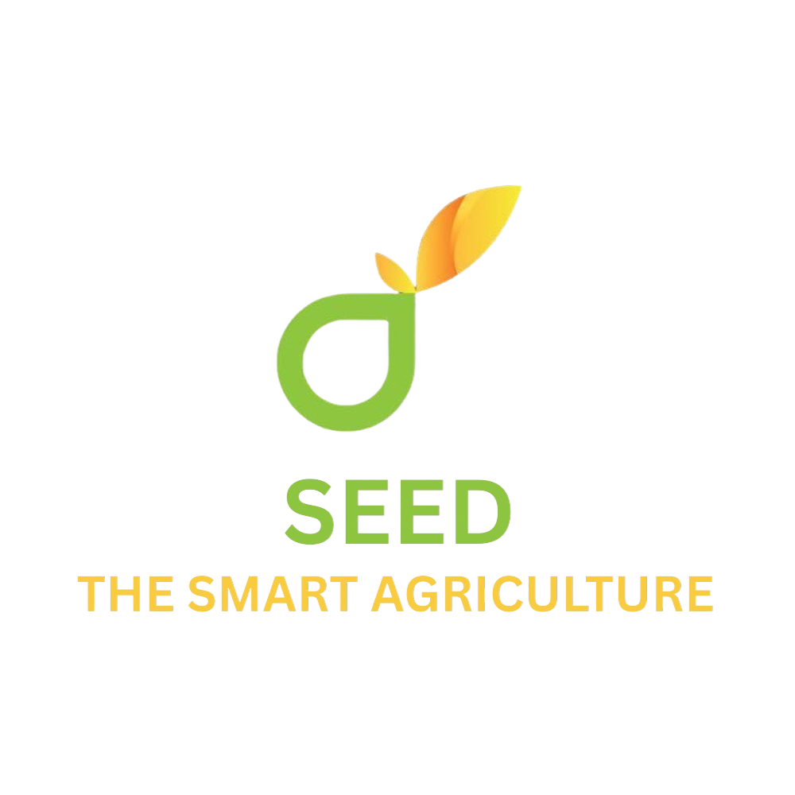

  

<h2 align="center"><b>SEED – IoT-Driven Smart Agriculture System</b></h2>

<h1>Overview</h1>

Smart Agriculture System that is an integrated platform to help farmers with real-time soil monitoring and crop suggestion based on IoT, artificial intelligence (AI), and machine learning (ML).

---

<h1>About the App</h1>

SEED integrates real-time soil sensing with AI-driven decision-making to provide personalized crop recommendations, fertilizer suggestions, disease detection, irrigation advice, and natural language conversational support.

The system is powered by an Espressif Systems 32-bit microcontroller (ESP32) and employs machine learning models trained on both live and historical datasets to deliver actionable insights directly to the farmer’s mobile device.

Through the integration of the Google Gemini API, advanced features such as chatbot interaction, image-based disease detection, and adaptive irrigation recommendations are enabled.

A cross-platform mobile application, developed using Flutter, supports multilingual functionality and offline-first capabilities to ensure usability in areas with limited connectivity.

<h1> Features</h1>

- Crop Recommendation
- FFertilizer Dosage
- Plant Disease Detection
- Irrigation Scheduling
---

<h1>System Architecture </h1> 

  

<h1>Circuit Diagram of SEED Device </h1>

  

<h1>Hardware Module</h1>

  

<h1>System Requirements </h1>

- **Operating System**&nbsp;&nbsp;&nbsp;&nbsp; Android 8.0 (Oreo) or higher  
- **RAM**&nbsp;&nbsp;&nbsp;&nbsp; Minimum 2 GB  
- **Storage**&nbsp;&nbsp;&nbsp;&nbsp; At least 500 MB free  
- **Internet**&nbsp;&nbsp;&nbsp;&nbsp; Wi-Fi or Mobile Data required  
- **Permissions**&nbsp;&nbsp;&nbsp;&nbsp; Internet access

<h1>Mobile App Features</h1>

- Crop Recommendation
- FFertilizer Dosage
- Plant Disease Detection
- Irrigation Scheduling
- Chatbot Support
- Crop Atlas
- Live Weather Data

<h1> Result</h1>
The SEED system was evaluated based on the accuracy of the prediction, user feedback, resource utilization, and cost-effectiveness. These metrics helped assess its practical usability and effectiveness in real-world farming scenarios

